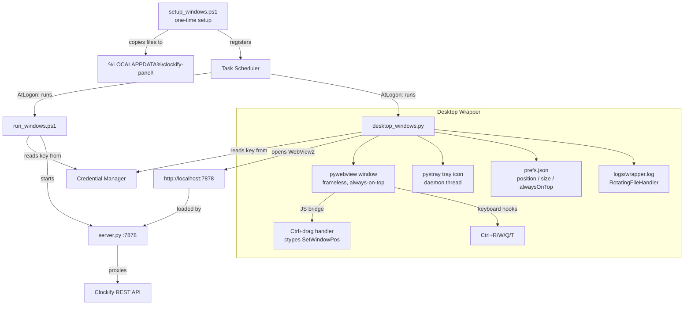
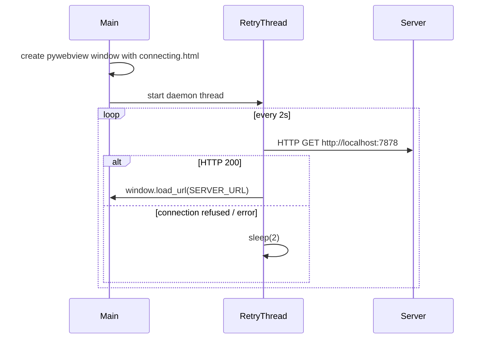

# Design Document: clockify-panel-windows

## Overview

This design describes the Windows-native layer that brings the Clockify desktop widget to Windows with full feature parity with the macOS version. The macOS widget consists of a shared Python HTTP server (`server.py`) and a single-page UI (`index.html`) that work on both platforms, wrapped by platform-native floating-window code. The Windows implementation reuses those two shared files without modification and adds:

1. `setup_windows.ps1` — one-time setup: API key storage, validation, dependency installation, file installation, Task Scheduler registration.
2. `run_windows.ps1` — run script: reads the API key from Credential Manager and starts `server.py`.
3. `desktop_windows.py` — desktop wrapper: a `pywebview`-backed frameless always-on-top window with a `pystray` system-tray icon, Ctrl+drag to move, keyboard shortcuts, startup retry, preference persistence, and log rotation.

All three new files live under `automations/clockify-panel/windows/`.

The design deliberately mirrors the macOS architecture:

| macOS | Windows |
|---|---|
| Keychain (`security`) | Credential Manager (`cmdkey.exe` / `keyring`) |
| launchd plist | Task Scheduler (`schtasks.exe`) |
| Swift/WKWebView | Python/pywebview (WebView2) |
| Cmd+drag via NSWindow.sendEvent | Ctrl+drag via JS bridge + ctypes |
| NSStatusItem (menu bar) | pystray (system tray) |
| `UserDefaults` persistence | JSON prefs file |

---

## Architecture



### Component responsibilities

- **`setup_windows.ps1`**: idempotent setup, run once by the user. Stores the API key, validates it, sets project colors, checks/installs Python dependencies, copies runtime files, registers Task Scheduler tasks.
- **`run_windows.ps1`**: thin launcher. Reads the API key from Credential Manager, exports it, resolves `python`/`python3`, starts `server.py`. Used by both Task Scheduler and manual execution.
- **`desktop_windows.py`**: the floating window process. `pywebview` drives the main thread; `pystray` runs on a daemon thread. A startup retry loop polls `http://localhost:7878` before loading the real URL.
- **`server.py` / `index.html`**: unchanged shared files, installed to `%LOCALAPPDATA%\clockify-panel\` by setup.

---

## Components and Interfaces

### `setup_windows.ps1`

**Invocation**: `.\setup_windows.ps1 [<ApiKey>] [-SkipTaskScheduler]`

**Steps (in order)**:

1. If `<ApiKey>` argument provided → `cmdkey /add:clockify-panel /user:clockify /pass:<ApiKey>`. Exit with error if cmdkey returns non-zero.
2. If no argument → read existing key via `cmdkey /list` lookup; if not found, exit with error.
3. Validate key: `Invoke-WebRequest https://api.clockify.me/api/v1/user -Headers @{"X-Api-Key"=...} -TimeoutSec 10`. Exit with error on non-2xx or timeout. Print workspace ID on success.
4. Normalize project colors using an embedded Python snippet that reuses the same logic as `setup.sh` (urllib only, no new dependencies). Non-fatal: log warnings per project, summarise at end.
5. Check `python --version` / `python3 --version` ≥ 3.8. Exit with error if absent or below minimum.
6. Check `pip`. Exit with error if absent.
7. Try `python -c "import pywebview"`. If fails, `pip install pywebview`. Re-check; exit with error if still fails.
8. Try `python -c "import keyring"`. If fails, `pip install keyring`. Re-check; exit with error if still fails.
9. Create `%LOCALAPPDATA%\clockify-panel\` and `logs\` subdirectory. Copy `server.py`, `index.html`, `desktop_windows.py`, `run_windows.ps1`. Exit with error (naming the file) on any copy failure.
10. Unless `-SkipTaskScheduler`: register `ClockifyPanelServer` and `ClockifyPanelDesktop` tasks via `schtasks /Create /F` (overwrite). Start both immediately; warn (don't fail) if immediate start times out after 30 s.

**Idempotency**: Step 1 uses `cmdkey /add` which overwrites. Steps 7–8 check before installing. Steps 9 overwrites files. Step 10 uses `schtasks /F` which overwrites.

**Key retrieval helper** (used in steps 2 and by `run_windows.ps1`):
```powershell
# Read stored key from Credential Manager
$cred = cmdkey /list:clockify-panel
# Key is stored as password; retrieve via [System.Net.NetworkCredential]
# and the Windows CredentialManager COM interface through PowerShell
$keyEntry = Get-StoredCredential -Target "clockify-panel"  # via a small inline helper
```
Since `Get-StoredCredential` is not a built-in cmdlet, the scripts use a small inline C# snippet loaded via `Add-Type` to call `CredRead` from `advapi32.dll` directly, avoiding any dependency on the `CredentialManager` PowerShell module.

### `run_windows.ps1`

**Invocation**: `.\run_windows.ps1` (also called by Task Scheduler task)

**Steps**:
1. Call the `CredRead` inline helper to retrieve the credential with target `clockify-panel`. Exit with descriptive error if not found or retrieval fails.
2. Validate `PORT` env var if set: must be integer in `[1, 65535]`. Exit with error if invalid. Default `7878`.
3. Resolve python: try `python`, fall back to `python3`. Exit with error if neither found.
4. Set `$env:CLOCKIFY_API_KEY` and `$env:PORT`. Start `server.py` with `& $pythonExe "$installDir\server.py"`, forwarding stdout+stderr.

### `desktop_windows.py`

**Entry point**: `python desktop_windows.py`

**Imports**: `pywebview`, `pystray`, `PIL` (for tray icon), `keyring`, `ctypes`, `ctypes.wintypes`, `threading`, `json`, `os`, `logging`, `logging.handlers`, `urllib.request`, `time`

**Module-level constants**:
```python
SERVER_URL = "http://localhost:7878"
PREFS_PATH = os.path.join(os.environ["LOCALAPPDATA"], "clockify-panel", "prefs.json")
LOG_PATH   = os.path.join(os.environ["LOCALAPPDATA"], "clockify-panel", "logs", "wrapper.log")
DEFAULT_W, DEFAULT_H = 400, 600
MIN_W, MIN_H = 200, 150
MARGIN = 20
RETRY_INTERVAL = 2.0   # seconds between server polls
```

**Startup retry**: Before calling `webview.create_window`, the process polls `SERVER_URL` (HTTP HEAD or GET, 2-second interval, timeout=1 s). While not reachable, a `connecting.html` placeholder is loaded into the window. Once HTTP 200 is received, `window.load_url(SERVER_URL)` is called on the main thread via `webview.evaluate_js` callback.



**Thread model**:

| Thread | What runs there | Why |
|---|---|---|
| Main (OS) thread | `webview.start()` | pywebview requirement |
| Retry/monitor thread | Server poll loop → `window.load_url` | daemon, exits with main |
| Tray thread | `pystray.Icon.run()` | daemon, exits with main |

**Ctrl+drag implementation**:

1. On startup, `webview.evaluate_js` injects a JS snippet into the page that listens for `mousedown` with `event.ctrlKey`. On `ctrlKey+mousedown`, it calls `window.pywebview.api.drag_start(offsetX, offsetY)`. On `mousemove` with button held, it calls `window.pywebview.api.drag_move(screenX, screenY)`. On `mouseup`, it calls `window.pywebview.api.drag_end()`.
2. The Python `api` object exposes `drag_start`, `drag_move`, `drag_end` methods. `drag_move` calls `ctypes.windll.user32.SetWindowPos(hwnd, ...)` to reposition the native window.
3. `hwnd` is obtained from pywebview's `window.get_current_url()` indirectly — more reliably via `ctypes.windll.user32.FindWindow(None, window.title)` or by storing the HWND returned from the Win32 `WM_CREATE` message. In practice, pywebview exposes `window.gui` on Windows which holds the underlying handle.

**Preferences** (`prefs.json`):
```json
{
  "x": 1480,
  "y": 340,
  "width": 400,
  "height": 600,
  "alwaysOnTop": true
}
```
Read at startup; written after window move/resize/toggle. Default values computed at runtime as bottom-right position: `x = screen_width - DEFAULT_W - MARGIN`, `y = screen_height - DEFAULT_H - MARGIN`.

**Tray icon**: Created from a 64×64 PIL `Image` drawn with four colored quadrants (SS violet, GC red, JS blue, EF green) — matches the macOS icon style. The icon is created in-process without writing to disk.

**Tray menu structure**:
```
Show / Hide          (dynamic label)
───────────────
✓ Always on Top      (checkmark, toggles)
  Center on Screen
  Reload
───────────────
  Quit
```

**Keyboard shortcuts** (intercepted via pywebview JS injection):

| Shortcut | Action |
|---|---|
| Ctrl+R | `window.load_url(SERVER_URL)` |
| Ctrl+W / Ctrl+Q | `window.hide()` |
| Ctrl+T | toggle always-on-top + persist + sync tray checkmark |

These are injected as a `keydown` listener via `window.addEventListener('keydown', ...)` with `ctrlKey` check, using `event.preventDefault()` to prevent them from reaching the web content. The JS fires `window.pywebview.api.<action>()` to call back into Python.

**Logging**: `logging.handlers.RotatingFileHandler(LOG_PATH, maxBytes=5*1024*1024, backupCount=1, mode='a')`. The log directory is created with `os.makedirs(..., exist_ok=True)` before the handler is configured. `sys.excepthook` is replaced to log unhandled exceptions.

**Quit flow**:
1. Tray "Quit" or Ctrl+Q/W → `stop_everything()` called on tray or via JS bridge.
2. `stop_everything()`: calls `tray.stop()` (removes tray icon), then `webview.windows[0].destroy()` which ends `webview.start()` and returns from main.

---

## Data Models

### Preferences File (`prefs.json`)

```json
{
  "x":          <int>,   // window left edge, screen pixels
  "y":          <int>,   // window top edge, screen pixels
  "width":      <int>,   // window width, min 200
  "height":     <int>,   // window height, min 150
  "alwaysOnTop": <bool>  // Z-order preference
}
```

On read: any `json.JSONDecodeError` or `OSError` silently falls back to defaults. Extra/unknown keys are ignored. Values outside sane ranges (e.g. negative coordinates) are clamped to defaults.

### Task Scheduler Task XML

Two tasks are registered. Representative XML for `ClockifyPanelServer` (generated inline by the setup script via `schtasks /Create /XML`):

```xml
<?xml version="1.0" encoding="UTF-16"?>
<Task version="1.2" xmlns="http://schemas.microsoft.com/windows/2004/02/mit/task">
  <Triggers>
    <LogonTrigger>
      <Enabled>true</Enabled>
      <UserId>DOMAIN\Username</UserId>
    </LogonTrigger>
  </Triggers>
  <Principals>
    <Principal id="Author">
      <UserId>DOMAIN\Username</UserId>
      <LogonType>InteractiveToken</LogonType>
      <RunLevel>HighestAvailable</RunLevel>
    </Principal>
  </Principals>
  <Settings>
    <MultipleInstancesPolicy>IgnoreNew</MultipleInstancesPolicy>
    <ExecutionTimeLimit>PT0S</ExecutionTimeLimit>
    <StartWhenAvailable>true</StartWhenAvailable>
  </Settings>
  <Actions>
    <Exec>
      <Command>powershell.exe</Command>
      <Arguments>-NonInteractive -WindowStyle Hidden
        -File "%LOCALAPPDATA%\clockify-panel\run_windows.ps1"</Arguments>
      <WorkingDirectory>%LOCALAPPDATA%\clockify-panel</WorkingDirectory>
    </Exec>
  </Actions>
</Task>
```

`ClockifyPanelDesktop` is identical except the action runs `python.exe desktop_windows.py` with the install directory as working directory, and stdout/stderr are not redirected (the desktop wrapper handles its own logging).

### Log File (`logs/panel.log`, `logs/wrapper.log`)

The Panel_Server log is produced by the Task Scheduler task redirecting stdout+stderr via PowerShell:
```powershell
Start-Process python -ArgumentList "server.py" -RedirectStandardOutput $logPath -RedirectStandardError $logPath -NoNewWindow
```
Because `Start-Process` does not append to existing files, `run_windows.ps1` manually rotates the log before starting: if `panel.log` exceeds 5 MB, rename it to `panel.log.1` (overwriting any previous `.1`), then start fresh.

The Desktop_Wrapper log uses Python's `RotatingFileHandler` configured with `maxBytes=5_242_880` (5 MiB) and `backupCount=1`. Both logs use append mode.

### Credential Manager Entry

| Field | Value |
|---|---|
| Target name | `clockify-panel` |
| Username | `clockify` (sentinel; only the password is used) |
| Password | The Clockify API key |
| Type | `CRED_TYPE_GENERIC` (1) |
| Persistence | `CRED_PERSIST_LOCAL_MACHINE` (2) |

Stored by `cmdkey /add:clockify-panel /user:clockify /pass:<key>`. Read back via `CredRead` (Win32 API) called from the inline C# snippet in the PowerShell scripts, or via `keyring.get_password("clockify-panel", "clockify")` in Python.

### Connecting Placeholder HTML

```html
<!doctype html>
<html>
<head>
<style>
  body {
    margin: 0; height: 100vh;
    background: #1c1f26; color: #8b91a3;
    font: 14px -apple-system, "Segoe UI", sans-serif;
    display: flex; align-items: center;
    justify-content: center; flex-direction: column; gap: 12px;
  }
  .dot { width: 8px; height: 8px; border-radius: 50%;
         background: #5566ff; animation: pulse 1s ease-in-out infinite; }
  @keyframes pulse { 50% { opacity: .2; } }
</style>
</head>
<body>
  <div class="dot"></div>
  <span>Connecting…</span>
</body>
</html>
```

This matches `index.html`'s `--bg` background color (`#1c1f26`) to avoid a visible flash when the real panel loads.

---

## Correctness Properties

*A property is a characteristic or behavior that should hold true across all valid executions of a system — essentially, a formal statement about what the system should do. Properties serve as the bridge between human-readable specifications and machine-verifiable correctness guarantees.*

