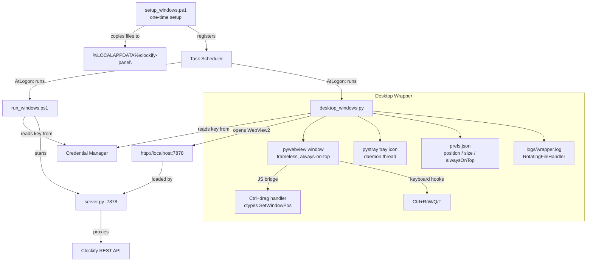
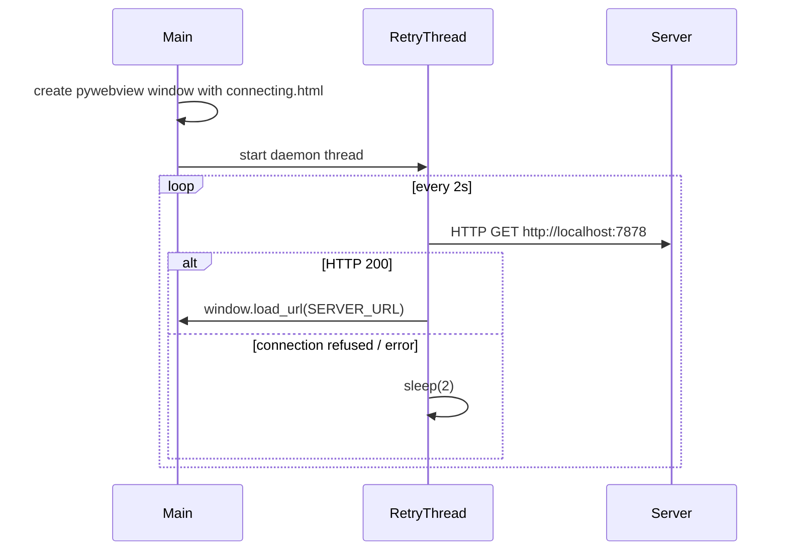

# Design Document: clockify-panel-windows

## Overview

This design describes the Windows-native layer that brings the Clockify desktop widget to Windows with full feature parity with the macOS version. The macOS widget consists of a shared Python HTTP server (`server.py`) and a single-page UI (`index.html`) that work on both platforms, wrapped by platform-native floating-window code. The Windows implementation reuses those two shared files without modification and adds:

1. `setup_windows.ps1` — one-time setup: API key storage, validation, dependency installation, file installation, Task Scheduler registration.
2. `run_windows.ps1` — run script: reads the API key from Credential Manager and starts `server.py`.
3. `desktop_windows.py` — desktop wrapper: a `pywebview`-backed frameless always-on-top window with a `pystray` system-tray icon, Ctrl+drag to move, keyboard shortcuts, startup retry, preference persistence, and log rotation.

All three new files live under `automations/clockify-panel/windows/`.

The design deliberately mirrors the macOS architecture:

| macOS | Windows |
|---|---|
| Keychain (`security`) | Credential Manager (`cmdkey.exe` / `keyring`) |
| launchd plist | Task Scheduler (`schtasks.exe`) |
| Swift/WKWebView | Python/pywebview (WebView2) |
| Cmd+drag via NSWindow.sendEvent | Ctrl+drag via JS bridge + ctypes |
| NSStatusItem (menu bar) | pystray (system tray) |
| `UserDefaults` persistence | JSON prefs file |

---

## Architecture



### Component responsibilities

- **`setup_windows.ps1`**: idempotent setup, run once by the user. Stores the API key, validates it, sets project colors, checks/installs Python dependencies, copies runtime files, registers Task Scheduler tasks.
- **`run_windows.ps1`**: thin launcher. Reads the API key from Credential Manager, exports it, resolves `python`/`python3`, starts `server.py`. Used by both Task Scheduler and manual execution.
- **`desktop_windows.py`**: the floating window process. `pywebview` drives the main thread; `pystray` runs on a daemon thread. A startup retry loop polls `http://localhost:7878` before loading the real URL.
- **`server.py` / `index.html`**: unchanged shared files, installed to `%LOCALAPPDATA%\clockify-panel\` by setup.

---

## Components and Interfaces

### `setup_windows.ps1`

**Invocation**: `.\setup_windows.ps1 [<ApiKey>] [-SkipTaskScheduler]`

**Steps (in order)**:

1. If `<ApiKey>` argument provided → `cmdkey /add:clockify-panel /user:clockify /pass:<ApiKey>`. Exit with error if cmdkey returns non-zero.
2. If no argument → read existing key via `cmdkey /list` lookup; if not found, exit with error.
3. Validate key: `Invoke-WebRequest https://api.clockify.me/api/v1/user -Headers @{"X-Api-Key"=...} -TimeoutSec 10`. Exit with error on non-2xx or timeout. Print workspace ID on success.
4. Normalize project colors using an embedded Python snippet that reuses the same logic as `setup.sh` (urllib only, no new dependencies). Non-fatal: log warnings per project, summarise at end.
5. Check `python --version` / `python3 --version` ≥ 3.8. Exit with error if absent or below minimum.
6. Check `pip`. Exit with error if absent.
7. Try `python -c "import pywebview"`. If fails, `pip install pywebview`. Re-check; exit with error if still fails.
8. Try `python -c "import keyring"`. If fails, `pip install keyring`. Re-check; exit with error if still fails.
9. Create `%LOCALAPPDATA%\clockify-panel\` and `logs\` subdirectory. Copy `server.py`, `index.html`, `desktop_windows.py`, `run_windows.ps1`. Exit with error (naming the file) on any copy failure.
10. Unless `-SkipTaskScheduler`: register `ClockifyPanelServer` and `ClockifyPanelDesktop` tasks via `schtasks /Create /F` (overwrite). Start both immediately; warn (don't fail) if immediate start times out after 30 s.

**Idempotency**: Step 1 uses `cmdkey /add` which overwrites. Steps 7–8 check before installing. Steps 9 overwrites files. Step 10 uses `schtasks /F` which overwrites.

**Key retrieval helper** (used in steps 2 and by `run_windows.ps1`):
```powershell
# Read stored key from Credential Manager
$cred = cmdkey /list:clockify-panel
# Key is stored as password; retrieve via [System.Net.NetworkCredential]
# and the Windows CredentialManager COM interface through PowerShell
$keyEntry = Get-StoredCredential -Target "clockify-panel"  # via a small inline helper
```
Since `Get-StoredCredential` is not a built-in cmdlet, the scripts use a small inline C# snippet loaded via `Add-Type` to call `CredRead` from `advapi32.dll` directly, avoiding any dependency on the `CredentialManager` PowerShell module.

### `run_windows.ps1`

**Invocation**: `.\run_windows.ps1` (also called by Task Scheduler task)

**Steps**:
1. Call the `CredRead` inline helper to retrieve the credential with target `clockify-panel`. Exit with descriptive error if not found or retrieval fails.
2. Validate `PORT` env var if set: must be integer in `[1, 65535]`. Exit with error if invalid. Default `7878`.
3. Resolve python: try `python`, fall back to `python3`. Exit with error if neither found.
4. Set `$env:CLOCKIFY_API_KEY` and `$env:PORT`. Start `server.py` with `& $pythonExe "$installDir\server.py"`, forwarding stdout+stderr.

### `desktop_windows.py`

**Entry point**: `python desktop_windows.py`

**Imports**: `pywebview`, `pystray`, `PIL` (for tray icon), `keyring`, `ctypes`, `ctypes.wintypes`, `threading`, `json`, `os`, `logging`, `logging.handlers`, `urllib.request`, `time`

**Module-level constants**:
```python
SERVER_URL = "http://localhost:7878"
PREFS_PATH = os.path.join(os.environ["LOCALAPPDATA"], "clockify-panel", "prefs.json")
LOG_PATH   = os.path.join(os.environ["LOCALAPPDATA"], "clockify-panel", "logs", "wrapper.log")
DEFAULT_W, DEFAULT_H = 400, 600
MIN_W, MIN_H = 200, 150
MARGIN = 20
RETRY_INTERVAL = 2.0   # seconds between server polls
```

**Startup retry**: Before calling `webview.create_window`, the process polls `SERVER_URL` (HTTP HEAD or GET, 2-second interval, timeout=1 s). While not reachable, a `connecting.html` placeholder is loaded into the window. Once HTTP 200 is received, `window.load_url(SERVER_URL)` is called on the main thread via `webview.evaluate_js` callback.



**Thread model**:

| Thread | What runs there | Why |
|---|---|---|
| Main (OS) thread | `webview.start()` | pywebview requirement |
| Retry/monitor thread | Server poll loop → `window.load_url` | daemon, exits with main |
| Tray thread | `pystray.Icon.run()` | daemon, exits with main |

**Ctrl+drag implementation**:

1. On startup, `webview.evaluate_js` injects a JS snippet into the page that listens for `mousedown` with `event.ctrlKey`. On `ctrlKey+mousedown`, it calls `window.pywebview.api.drag_start(offsetX, offsetY)`. On `mousemove` with button held, it calls `window.pywebview.api.drag_move(screenX, screenY)`. On `mouseup`, it calls `window.pywebview.api.drag_end()`.
2. The Python `api` object exposes `drag_start`, `drag_move`, `drag_end` methods. `drag_move` calls `ctypes.windll.user32.SetWindowPos(hwnd, ...)` to reposition the native window.
3. `hwnd` is obtained from pywebview's `window.get_current_url()` indirectly — more reliably via `ctypes.windll.user32.FindWindow(None, window.title)` or by storing the HWND returned from the Win32 `WM_CREATE` message. In practice, pywebview exposes `window.gui` on Windows which holds the underlying handle.

**Preferences** (`prefs.json`):
```json
{
  "x": 1480,
  "y": 340,
  "width": 400,
  "height": 600,
  "alwaysOnTop": true
}
```
Read at startup; written after window move/resize/toggle. Default values computed at runtime as bottom-right position: `x = screen_width - DEFAULT_W - MARGIN`, `y = screen_height - DEFAULT_H - MARGIN`.

**Tray icon**: Created from a 64×64 PIL `Image` drawn with four colored quadrants (SS violet, GC red, JS blue, EF green) — matches the macOS icon style. The icon is created in-process without writing to disk.

**Tray menu structure**:
```
Show / Hide          (dynamic label)
───────────────
✓ Always on Top      (checkmark, toggles)
  Center on Screen
  Reload
───────────────
  Quit
```

**Keyboard shortcuts** (intercepted via pywebview JS injection):

| Shortcut | Action |
|---|---|
| Ctrl+R | `window.load_url(SERVER_URL)` |
| Ctrl+W / Ctrl+Q | `window.hide()` |
| Ctrl+T | toggle always-on-top + persist + sync tray checkmark |

These are injected as a `keydown` listener via `window.addEventListener('keydown', ...)` with `ctrlKey` check, using `event.preventDefault()` to prevent them from reaching the web content. The JS fires `window.pywebview.api.<action>()` to call back into Python.

**Logging**: `logging.handlers.RotatingFileHandler(LOG_PATH, maxBytes=5*1024*1024, backupCount=1, mode='a')`. The log directory is created with `os.makedirs(..., exist_ok=True)` before the handler is configured. `sys.excepthook` is replaced to log unhandled exceptions.

**Quit flow**:
1. Tray "Quit" or Ctrl+Q/W → `stop_everything()` called on tray or via JS bridge.
2. `stop_everything()`: calls `tray.stop()` (removes tray icon), then `webview.windows[0].destroy()` which ends `webview.start()` and returns from main.

---

## Data Models

### Preferences File (`prefs.json`)

```json
{
  "x":          <int>,   // window left edge, screen pixels
  "y":          <int>,   // window top edge, screen pixels
  "width":      <int>,   // window width, min 200
  "height":     <int>,   // window height, min 150
  "alwaysOnTop": <bool>  // Z-order preference
}
```

On read: any `json.JSONDecodeError` or `OSError` silently falls back to defaults. Extra/unknown keys are ignored. Values outside sane ranges (e.g. negative coordinates) are clamped to defaults.

### Task Scheduler Task XML

Two tasks are registered. Representative XML for `ClockifyPanelServer` (generated inline by the setup script via `schtasks /Create /XML`):

```xml
<?xml version="1.0" encoding="UTF-16"?>
<Task version="1.2" xmlns="http://schemas.microsoft.com/windows/2004/02/mit/task">
  <Triggers>
    <LogonTrigger>
      <Enabled>true</Enabled>
      <UserId>DOMAIN\Username</UserId>
    </LogonTrigger>
  </Triggers>
  <Principals>
    <Principal id="Author">
      <UserId>DOMAIN\Username</UserId>
      <LogonType>InteractiveToken</LogonType>
      <RunLevel>HighestAvailable</RunLevel>
    </Principal>
  </Principals>
  <Settings>
    <MultipleInstancesPolicy>IgnoreNew</MultipleInstancesPolicy>
    <ExecutionTimeLimit>PT0S</ExecutionTimeLimit>
    <StartWhenAvailable>true</StartWhenAvailable>
  </Settings>
  <Actions>
    <Exec>
      <Command>powershell.exe</Command>
      <Arguments>-NonInteractive -WindowStyle Hidden
        -File "%LOCALAPPDATA%\clockify-panel\run_windows.ps1"</Arguments>
      <WorkingDirectory>%LOCALAPPDATA%\clockify-panel</WorkingDirectory>
    </Exec>
  </Actions>
</Task>
```

`ClockifyPanelDesktop` is identical except the action runs `python.exe desktop_windows.py` with the install directory as working directory, and stdout/stderr are not redirected (the desktop wrapper handles its own logging).

### Log File (`logs/panel.log`, `logs/wrapper.log`)

The Panel_Server log is produced by the Task Scheduler task redirecting stdout+stderr via PowerShell:
```powershell
Start-Process python -ArgumentList "server.py" -RedirectStandardOutput $logPath -RedirectStandardError $logPath -NoNewWindow
```
Because `Start-Process` does not append to existing files, `run_windows.ps1` manually rotates the log before starting: if `panel.log` exceeds 5 MB, rename it to `panel.log.1` (overwriting any previous `.1`), then start fresh.

The Desktop_Wrapper log uses Python's `RotatingFileHandler` configured with `maxBytes=5_242_880` (5 MiB) and `backupCount=1`. Both logs use append mode.

### Credential Manager Entry

| Field | Value |
|---|---|
| Target name | `clockify-panel` |
| Username | `clockify` (sentinel; only the password is used) |
| Password | The Clockify API key |
| Type | `CRED_TYPE_GENERIC` (1) |
| Persistence | `CRED_PERSIST_LOCAL_MACHINE` (2) |

Stored by `cmdkey /add:clockify-panel /user:clockify /pass:<key>`. Read back via `CredRead` (Win32 API) called from the inline C# snippet in the PowerShell scripts, or via `keyring.get_password("clockify-panel", "clockify")` in Python.

### Connecting Placeholder HTML

```html
<!doctype html>
<html>
<head>
<style>
  body {
    margin: 0; height: 100vh;
    background: #1c1f26; color: #8b91a3;
    font: 14px -apple-system, "Segoe UI", sans-serif;
    display: flex; align-items: center;
    justify-content: center; flex-direction: column; gap: 12px;
  }
  .dot { width: 8px; height: 8px; border-radius: 50%;
         background: #5566ff; animation: pulse 1s ease-in-out infinite; }
  @keyframes pulse { 50% { opacity: .2; } }
</style>
</head>
<body>
  <div class="dot"></div>
  <span>Connecting…</span>
</body>
</html>
```

This matches `index.html`'s `--bg` background color (`#1c1f26`) to avoid a visible flash when the real panel loads.

---

## Correctness Properties

*A property is a characteristic or behavior that should hold true across all valid executions of a system — essentially, a formal statement about what the system should do. Properties serve as the bridge between human-readable specifications and machine-verifiable correctness guarantees.*


### Property 1: Credential Storage Round-Trip

*For any* valid Clockify API key string stored in Windows Credential Manager under the target name `clockify-panel`, reading back the credential via `CredRead` (or `keyring.get_password`) SHALL return a value byte-for-byte identical to the stored key.

**Validates: Requirements 1.1, 1.4**

---

### Property 2: Run Script Propagates Stored Key to Server Environment

*For any* API key stored in Credential Manager, when `run_windows.ps1` executes, the `CLOCKIFY_API_KEY` environment variable exported to the `server.py` child process SHALL equal the stored key exactly — no truncation, encoding change, or whitespace alteration.

**Validates: Requirements 1.4, 5.1**

---

### Property 3: Validation Error Message Contains HTTP Status

*For any* non-2xx HTTP status code returned by the Clockify `/user` endpoint during setup validation, the Setup_Script's error output SHALL contain that specific status code as a string.

**Validates: Requirements 2.2**

---

### Property 4: Workspace ID Appears in Output

*For any* valid workspace ID string present in the `/user` API response, the Setup_Script's output SHALL contain that exact workspace ID string.

**Validates: Requirements 2.4**

---

### Property 5: Color Normalization Idempotency

*For any* initial set of project colors in the Clockify workspace, after the Setup_Script runs color normalization once, all four projects (SS, GC, JS, EF) that exist and are writable SHALL have their canonical target colors (`#7E57C2`, `#F44336`, `#2196F3`, `#4CAF50`). Running normalization a second time SHALL issue zero PUT requests (all colors already match).

**Validates: Requirements 3.1, 3.4**

---

### Property 6: -SkipTaskScheduler Suppresses All Task Registration Calls

*For any* execution of `setup_windows.ps1` with the `-SkipTaskScheduler` switch, no invocation of `schtasks.exe` with `/Create` SHALL occur, while all other setup steps (key storage, validation, dependency checks, file installation) SHALL still complete.

**Validates: Requirements 4.7**

---

### Property 7: Task Scheduler Idempotency

*For any* pair of consecutive executions of `setup_windows.ps1` (without `-SkipTaskScheduler`), the state of both Task Scheduler tasks after the second execution SHALL be identical to their state after the first execution — same trigger, same action, same run level.

**Validates: Requirements 4.4**

---

### Property 8: Python Resolver Prefers `python` Over `python3`

*For any* combination of `python` and `python3` PATH availability, if `python` is resolvable on PATH, `run_windows.ps1` SHALL invoke `python` (not `python3`); if `python` is absent but `python3` is present, `run_windows.ps1` SHALL invoke `python3`.

**Validates: Requirements 5.2**

---

### Property 9: PORT Validation Accepts Exactly [1, 65535]

*For any* integer value assigned to the `PORT` environment variable, `run_windows.ps1` SHALL start the server if and only if the value is in the inclusive range [1, 65535]; any value outside that range SHALL cause the script to exit with a non-zero code before starting the server.

**Validates: Requirements 5.4**

---

### Property 10: Preference Restore Round-Trip

*For any* valid `prefs.json` containing `x`, `y`, `width`, `height`, and `alwaysOnTop` fields with sane values, the Desktop_Wrapper SHALL restore the window to the exact position, size, and always-on-top state described in the file; if the file is absent or contains invalid JSON, the Desktop_Wrapper SHALL silently fall back to the first-launch defaults without crashing.

**Validates: Requirements 6.4, 7.5**

---

### Property 11: Always-on-Top Toggle + Persist Round-Trip

*For any* initial `alwaysOnTop` boolean value loaded from preferences, toggling via the tray menu or `Ctrl+T` SHALL invert the value, persist the new value to `prefs.json`, and update the tray menu checkmark to reflect the new value — so that a subsequent Desktop_Wrapper launch restores the toggled state.

**Validates: Requirements 7.3, 7.4, 7.5, 8.3**

---

### Property 12: Startup Retry Loads Panel After Server Becomes Available

*For any* number of consecutive failed polls of `http://localhost:7878` (connection refused, timeout, or non-200 response), once the server returns an HTTP 200 response, the Desktop_Wrapper SHALL call `window.load_url(SERVER_URL)` exactly once without requiring any user intervention.

**Validates: Requirements 9.1, 9.2**

---

### Property 13: Installed Files Are Byte-for-Byte Identical to Sources

*For any* source file (`server.py`, `index.html`, `desktop_windows.py`, `run_windows.ps1`) copied by the Setup_Script to `%LOCALAPPDATA%\clockify-panel\`, the installed copy SHALL be byte-for-byte identical to the source file at the time of installation.

**Validates: Requirements 10.1, 10.2, 10.3, 12.2**

---

### Property 14: Python Version Gate Rejects Below 3.8

*For any* Python version string reported by `python --version`, the Setup_Script SHALL reject (exit with error) any version where the major version is less than 3, or the major version is exactly 3 and the minor version is less than 8; any version ≥ 3.8 SHALL be accepted.

**Validates: Requirements 11.1, 11.2**

---

### Property 15: Unhandled Exceptions Appear in wrapper.log

*For any* unhandled exception raised inside `desktop_windows.py` (at any point from process initialization through the first successful API call), the full exception traceback SHALL be appended to `%LOCALAPPDATA%\clockify-panel\logs\wrapper.log`; if the log directory does not yet exist, it SHALL be created automatically before writing.

**Validates: Requirements 13.2**

---

### Property 16: Log Append Preserves Prior Content

*For any* existing content in `wrapper.log`, restarting the Desktop_Wrapper SHALL append new log entries without overwriting or truncating the prior content — the file size after restart SHALL be greater than or equal to its size before restart.

**Validates: Requirements 13.3**

---

### Property 17: Log Rotation Triggers at 5 MB

*For any* `wrapper.log` that reaches or exceeds 5 MiB (5,242,880 bytes), the `RotatingFileHandler` SHALL rename the existing file to `wrapper.log.1` (overwriting any previous `.1` backup) and start a fresh `wrapper.log`; no `wrapper.log.2` or higher SHALL be created.

**Validates: Requirements 13.4**

---

## Error Handling

### Setup Script (`setup_windows.ps1`)

| Failure condition | Response |
|---|---|
| `cmdkey.exe` returns non-zero on key storage | Fatal exit with "Could not store API key" + cmdkey output |
| No key argument and no key in Credential Manager | Fatal exit: "Run `setup_windows.ps1 <API_KEY>`" |
| Clockify API returns non-2xx | Fatal exit: "API key rejected — HTTP \<status\>" |
| Clockify API timeout (>10 s) | Fatal exit: "Connection to Clockify timed out" |
| Python not found or < 3.8 | Fatal exit: "Install Python 3.8+ from python.org and re-run" |
| pip not found | Fatal exit: "Install pip and re-run" |
| `pip install pywebview` fails or import still fails | Fatal exit: "Failed to install pywebview" |
| `pip install keyring` fails or import still fails | Fatal exit: "Failed to install keyring" |
| File copy fails | Fatal exit: "Failed to copy \<filename\>: \<reason\>" |
| Task Scheduler registration fails | Fatal exit: "Failed to register task \<name\>: \<reason\>" |
| Project not found (color step) | Non-fatal warning; continue |
| HTTP 403 on color update | Non-fatal warning: "Change color in Clockify web UI"; continue |
| Other project color failure | Non-fatal warning with reason; continue |
| Task immediate start fails or times out | Non-fatal warning; overall success if tasks registered |

### Run Script (`run_windows.ps1`)

| Failure condition | Response |
|---|---|
| Key not in Credential Manager | Non-zero exit: "Run `setup_windows.ps1 <API_KEY>` first" |
| `CredRead` call fails | Non-zero exit with Win32 error description |
| Neither `python` nor `python3` on PATH | Non-zero exit with instruction to install Python |
| PORT out of range | Non-zero exit: "PORT must be 1–65535" |

### Desktop Wrapper (`desktop_windows.py`)

| Failure condition | Response |
|---|---|
| `prefs.json` missing | Silent fallback to defaults |
| `prefs.json` corrupt (bad JSON) | Silent fallback to defaults; log at DEBUG level |
| Preference value out of sane range (negative coords, size below minimum) | Clamp to default for that field |
| Unhandled exception during startup | Full traceback to `wrapper.log`; try to display error in window if pywebview is running |
| Server not reachable at startup | Display "Connecting…" placeholder; retry every 2 s |
| Log directory creation fails | Log silently to stderr; continue without file logging |
| `keyring.get_password` returns None | Log warning; proceed (server.py will report missing key) |

---

## Testing Strategy

### When PBT Applies

This feature is a mix of:
- **Scripting logic** (key storage/retrieval, file copying, version parsing, PORT validation, log rotation) — PBT applies
- **Infrastructure wiring** (Task Scheduler, Credential Manager, pywebview, pystray) — integration tests
- **UI behavior** (tray icon rendering, window dragging, keyboard shortcuts in WebView) — example-based tests

Property-based tests focus on the pure logic layers where input variation exposes edge cases. Integration tests cover wiring and external-service interactions.

### Property-Based Testing

**Library**: [Hypothesis](https://hypothesis.readthedocs.io/en/latest/) (Python) for `desktop_windows.py` and any testable Python logic; [PSScriptAnalyzer](https://learn.microsoft.com/en-us/powershell/module/psscriptanalyzer/) with [Pester](https://pester.dev/) for PowerShell script logic. For the PBT properties that involve PowerShell, a thin Python test harness can call the PowerShell functions via `subprocess` with mocked external commands (`cmdkey.exe`, `schtasks.exe`, Clockify API).

**Minimum iterations**: 100 per property.

**Tag format**: `# Feature: clockify-panel-windows, Property N: <property_text>`

| Design Property | Test Module | What's Generated |
|---|---|---|
| Property 1: Credential round-trip | `test_credential.py` | Random API key strings (printable ASCII, varying length) |
| Property 2: Key propagation to env | `test_run_script.py` | Random API key strings; mocked CredRead |
| Property 3: HTTP status in error | `test_setup_validation.py` | Random non-2xx status codes (300–599) |
| Property 4: Workspace ID in output | `test_setup_validation.py` | Random UUID-like workspace ID strings |
| Property 5: Color normalization idempotency | `test_color_normalization.py` | Random project color hex strings for each project |
| Property 6: -SkipTaskScheduler suppresses schtasks | `test_setup_tasks.py` | N/A — run with flag; verify no schtasks /Create calls |
| Property 7: Task Scheduler idempotency | `test_setup_tasks.py` | Run twice; compare task state |
| Property 8: Python resolver order | `test_run_script.py` | Different PATH configurations (python only, python3 only, both, neither) |
| Property 9: PORT validation | `test_run_script.py` | Random integers (full int32 range) |
| Property 10: Prefs restore round-trip | `test_prefs.py` | Random (x, y, width, height, alwaysOnTop) tuples |
| Property 11: Always-on-top toggle + persist | `test_prefs.py` | Random initial boolean state |
| Property 12: Startup retry | `test_retry.py` | Random number of failed polls (0–50) before success |
| Property 13: Installed files byte-identical | `test_installation.py` | Different source file contents (to test the copy function, not the files themselves) |
| Property 14: Python version gate | `test_setup_deps.py` | Random version tuples (major, minor, patch) |
| Property 15: Exceptions to log | `test_logging.py` | Random exception types and messages |
| Property 16: Log append preserves content | `test_logging.py` | Random initial log content strings |
| Property 17: Log rotation at 5 MB | `test_logging.py` | Random content sizes around the 5 MiB threshold |

### Unit / Example Tests

These cover specific behaviors not suited to PBT:

- **Tray menu**: verify all required items (`Show/Hide`, `Always on Top`, `Center on Screen`, `Reload`, `Quit`) are present with correct labels and checkmark state.
- **Keyboard shortcuts**: simulate `Ctrl+R`, `Ctrl+W`, `Ctrl+Q`, `Ctrl+T` key events in the injected JS handler; verify the correct Python API method is called.
- **Credential Manager absence**: verify `run_windows.ps1` exits non-zero when no credential is stored.
- **pip not found**: verify setup exits with error.
- **Overwrite failure on file copy**: verify setup halts and reports the failing file name.
- **Task registration failure**: verify setup exits identifying the failing task.
- **Quit flow**: verify `tray.stop()` is called before `window.destroy()`.
- **Server byte identity**: after installation, `sha256(installed_server.py) == sha256(source_server.py)`.
- **Task XML structure**: verify AtLogon trigger and HighestAvailable run level in generated XML.
- **Task references LOCALAPPDATA path**: verify task action path starts with `%LOCALAPPDATA%\clockify-panel\`.

### Integration Tests

Run manually or in a CI environment with a Windows runner:

- Full `setup_windows.ps1` run against a real Credential Manager entry (with a test API key).
- `run_windows.ps1` starts `server.py` and the server responds on the expected port.
- Desktop wrapper launches, displays "Connecting…" placeholder, then loads the panel after server starts.
- Task Scheduler tasks registered with correct triggers (verify via `schtasks /Query`).
- Log files created in correct locations with expected content after server/wrapper run.

### Balance Notes

- Property tests cover all pure-function correctness concerns (parsing, validation, round-trips, invariants).
- Unit tests focus on specific error conditions and control flow examples not worth 100-iteration coverage.
- Integration tests verify Windows-specific wiring that cannot be exercised in pure Python/PowerShell unit tests.
- The shared `server.py` and `index.html` are tested by the existing macOS test suite; no re-testing of those files is needed here.
